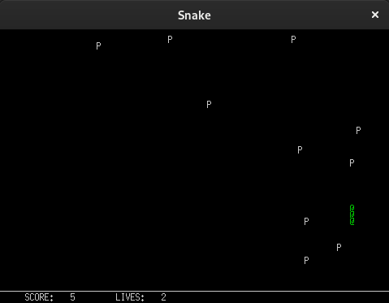

# Snake
Simple Snake game built with C, C++, CMAKE, for Linux based systems.

## GUI
The graphical interface is based on XLib, through the following wrapper, written in C: [gfx v2](https://www3.nd.edu/~dthain/courses/cse20211/fall2013/gfx/) (University of Notre Dame) with some modifications made by me. The modified gfx files are included in the source files. Needless to say, I have no rights over them. Nevertheless, if the functions I added ('gfx_text', 'gfx_close') are found useful for some purpose, feel free to use them however you want.

## Compiling
gfx v2 was compiled (into *gfx/libgfx.a*) using GCC 10.2.1 with the following flags:
> -fPIC -c -lX11 -lm -pthread -DNDEBUG

For the compilation of the game itself, those flags were used:

> -std=c++11 -Wall -Werror -pedantic-errors -Lgfx -lgfx -lX11 -lm -pthread -DNDEBUG

## How to launch
Open the executable file "snake". The game windows is supposed to appear immediately.

## Rules
Navigation is done using the *'w', 'a', 's', 'd'* keys. Use *'q'* in order to quit and close the window. For each fruit you cross in your movement, one point will be added to your score. In the beginning of each game, you start with 3 lives. A life is deduced whenever the snake crosses itself. Once all the lives are over, the game ends. Moreover, whenever the snake exits the boundaries of the window, the game ends as well.

